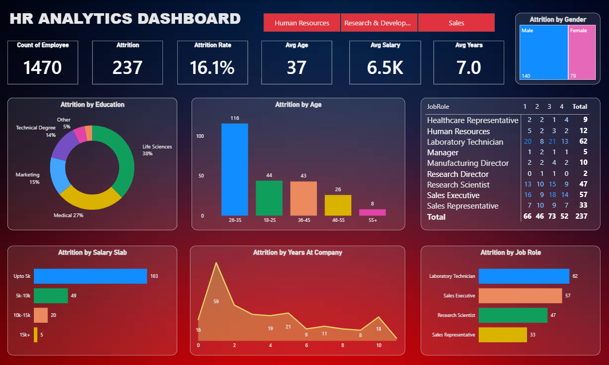

# 👨‍💼 HR Analytics Dashboard

## 📌 Project Overview
The HR Analytics Dashboard is an interactive Power BI dashboard designed to analyze employee attrition, workforce demographics, salary trends, and job role performance. It provides valuable HR insights through visualizations and key performance indicators (KPIs) to support data-driven workforce planning and employee retention strategies.

## 🎯 Objectives
- Analyze overall employee attrition.
- Monitor workforce demographics and trends.
- Identify departments and job roles with high attrition.
- Analyze attrition by age, gender, education, and salary.
- Track employee tenure and retention patterns.
- Support HR decision-making with actionable insights.

## 📊 Dashboard Features
- Employee Count KPI
- Attrition & Attrition Rate Analysis
- Average Age, Salary, and Years at Company
- Attrition by Education
- Attrition by Age Group
- Attrition by Gender
- Attrition by Salary Slab
- Attrition by Years at Company
- Attrition by Job Role
- Department-wise Analysis

## 🛠️ Tools & Technologies
- Power BI
- Microsoft Excel / CSV Dataset
- Data Modeling
- Data Visualization
- DAX
- Power Query

## 📈 Key Metrics
- Total Employees: 1470
- Attrition Count: 237
- Attrition Rate: 16.1%
- Average Age: 37 Years
- Average Salary: 6.5K
- Average Tenure: 7 Years

## 📷 Dashboard Preview

  

## 🚀 Outcome
This dashboard helps HR teams monitor employee turnover, identify key factors influencing attrition, analyze workforce demographics, and improve employee retention through interactive business intelligence visualizations.

## 👨‍💻 Author
**Khanjan Gandhi**

## 🔗 Project Type
Data Analytics | Human Resources Analytics | Power BI Dashboard
